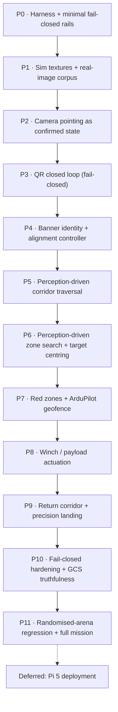

# AeroTHON 2026 Mission 2 — Phased Execution Plan

**Created:** 2026-08-15
**Basis:** `goal.md` (30 locked requirements) + `CURRENT_PROGRESS_HANDOFF.md` (honest defect list)
**Supersedes:** the "Recommended repair order" section of the handoff (reordered per user direction)

---

## 0. Ground rules agreed with the user

| Decision | Choice |
|---|---|
| **Ordering priority** | **Perception loops first** — camera pointing, QR, banner are the highest-uncertainty work |
| **Timeline** | No fixed deadline. Phases sequenced by dependency, not calendar |
| **Sim asset fidelity** | **Both** — real Gazebo textures *and* a real-photo regression corpus |
| **Definition of phase-complete** | **Full evidence pack**: automated test + live SITL run + rosbag + annotated video + written note in `VERIFICATION.md` |
| **Execution mode** | **Gate at each phase boundary** — full phase runs autonomously, then stop for go-ahead |
| **In scope** | Winch/payload actuation · Red zones + ArduPilot geofence · GCS truthfulness |
| **Deferred** | Pi 5 hardware deployment (Docker arm64, systemd, udev, serial router vs real Pixhawk, core pinning) |
| **Arena geometry** | **Fully perception-driven — no fixed waypoint constants.** Geofence-derived coarse prior exists only as a non-default fallback profile |

### Standing risk note

Fully perception-driven navigation is a materially harder autonomy problem than parameterised waypoints. Every stage transition must be earned from a sensor observation, which means every stage needs its own detector, its own confidence gate, and its own failure path. Accepted deliberately; mitigated by (a) the fallback geofence profile, (b) randomised-arena regression testing as the acceptance proof.

### Immediate housekeeping

A stale Level-6 stack is still running from the previous session (PGID `176131`). Kill it before Phase 0:

```bash
kill -TERM -- -176131
```

---

## 1. Phase map



---

## Phase 0 — Test harness and minimal fail-closed rails

**Why first:** you cannot debug perception on a state machine that reports success when it failed, and you cannot produce an evidence pack without evidence tooling. Kept deliberately small — this is not the full hardening phase (that's P10).

**Work**
- Kill the stale stack; make `scripts/launch_level6_sim.sh` idempotent (detect + reap prior PGID on start).
- Evidence tooling: `scripts/capture_evidence.sh` — starts a scoped `rosbag2` record, grabs camera + RViz + GCS frames, writes to `evidence/<phase>/<timestamp>/`.
- `VERIFICATION.md` scaffold: one append-only section per phase (claim → method → raw output → verdict).
- **Minimal rails only:**
  - No setpoint publication while disarmed outside `ARMING`.
  - `LAND` / `DISARM` / `ABORT` cancel and reset the behaviour tree to `WAITING`.
  - `/mission/result` topic with latched `{state, reason}` — no more silent stage-stalling.
  - Excessive-attitude abort (the last run sat at 54° tilt against a wall and nothing complained).
- Geometry audit: enumerate every hardcoded constant in `mission_tree.py`, tag each with which phase replaces it with a perception source. Produces `docs/GEOMETRY_AUDIT.md`.

**Acceptance**
- Tree provably returns to `WAITING` after external LAND/DISARM, asserted by a launch test.
- Attitude abort fires in a deliberately induced tilt.
- `capture_evidence.sh` produces a complete pack on a trivial run.

**Files:** `scripts/launch_level6_sim.sh`, `scripts/capture_evidence.sh`, `src/aerothon_mission/mission_bt/mission_bt/mission_tree.py`, `mav_commander.py`, `VERIFICATION.md`, `docs/GEOMETRY_AUDIT.md`

### ✅ STATUS: COMPLETE (2026-08-15) — see `VERIFICATION.md` §0

39 offline tests + **13/13 live SITL checks**. Every rail mutation-tested. Five rails shipped (the fourth and fifth were found *by* the work):

1. No setpoints to a disarmed aircraft
2. External DISARM / uncommanded LAND-RTL resets the tree to `WAITING`
3. Excessive-attitude abort with a stated reason
4. `/mission/result` latches one outcome per run as JSON
5. **Abort latches** — found live when an abort released itself and the mission resumed mid-flight

**Also delivered (unplanned, required to make the phase possible):**
- `scripts/install_ardupilot_overlay.sh` — the ArduPilot/Gazebo overlay had been built into `/tmp` and destroyed by a reboot. Now rebuilt persistently into `~/aerothon_stack`, reproducibly, without root.
- `scripts/run_tests.sh` — one-command offline suite.
- Three launch defects fixed (self-killing reaper, ArduCopter crash-looping on DDS parameters, router fed on the wrong port).
- Two test-integrity defects fixed (`mavros_msgs` mock poisoning every later test file; `preflight_stack.sh` reporting four false failures).

**Deliberately NOT fixed here — assigned onward (`VERIFICATION.md` §0.13):**
- Aircraft cannot hold a stable climb (sustained >45° tilt in takeoff) → **P2**
- Mission advances while the aircraft sits at 0.1 m altitude → **P5** / **P10**
- Telemetry rates far below spec (pose ~2 Hz, `/scan` 6.8 Hz vs Q27's ≥8 Hz) → **P2**

---

## Phase 1 — Sim asset realism + real-image regression corpus

**Why here:** every perception result from here on is only as trustworthy as what it was measured against. Currently QR pads render as untextured box geometry, so "QR detection works" has never been tested through the sim camera at all.

**Work — 1a, Gazebo textures**
- Fix the OGRE2 / PBR material path for Harmonic (`<material><pbr><metal><albedo_map>`) with correct `GZ_SIM_RESOURCE_PATH` and relative URIs; this is where the previous attempt failed.
- Real decodable QR textures on start pad + target pads (`AEROTHON2026:M2:TARGET_*`), real green `AEROTHON` banner texture with lettering (lettering matters for P4 identity validation).
- Ground-truth check: decode from the *sim camera stream* at 3 / 5 / 10 m nadir, and at 15°/30° off-axis.

**Work — 1b, real-image corpus**
- Printed QR at measured stand-offs and angles, real green banner, indoor + direct sun + overcast.
- `tests/perception/corpus/` + `pytest` regression asserting decode rate and HSV segmentation IoU against hand-labelled ground truth.
- Sim-vs-real delta report: if the sim decodes at 10 m and reality fails at 6 m, every downstream altitude assumption changes.

**Acceptance**
- Decode-rate table (distance × angle × lighting) for sim and real, both committed.
- Banner segmentation passes IoU threshold across the full lighting sweep.
- Documented **max reliable QR stand-off** — this number sets the search altitude in P6, replacing the `search_alt = 10.0` guess.

**Files:** `src/aerothon_sim/sim_gazebo/worlds/mission2.sdf`, `materials/`, `scripts/generate_competition_assets.py`, `scripts/materialize_world.py`, `tests/perception/`

**Note:** 1b needs you to physically shoot the corpus (printed QR + banner + camera). I'll specify the exact shot list; you capture, I build the harness.

### ✅ STATUS: 1a COMPLETE, 1b BLOCKED ON PHOTOGRAPHS (2026-08-16) — see `VERIFICATION.md` §1

**The camera was pointing at the sky.** The decode sweep returned zero decodes at every altitude, including 12.3 px/module at 3 m. The captured nadir frame was blank blue. The `webcam_pitch_joint` axis was `+Y`, which inverts the pitch sense — the model could look 30° down and 94° **up**, so every NADIR command aimed at the sky. Fixed to `-Y`.

This is a **correction to Phase 2**, which verified that the joint *reached* −90° but never that it was *looking* at the ground. Guarded now by a test that asserts the resulting view direction, and that the SDF and URDF axes agree.

**Texture work cancelled — not required.** Once aimed correctly, the existing box-geometry QR decodes at 100% at 3 m and 5 m. The handoff's "texture rendering was unreliable" was a misattribution of the aiming bug.

**Decode envelope measured** (`docs/QR_DECODE_ENVELOPE.md`, `docs/qr_decode_envelope.csv`):

| altitude | px/module | decode rate |
|---:|---:|---:|
| 3 m | 12.32 | 100% |
| 5 m | 7.39 | 100% |
| 7 m | 5.28 | 90% |
| 10 m | 3.70 | 30% |

Reliable floor **≈5.3 px/module**, and only within the inner quarter of the half-FOV.

**This kills `search_alt = 10.0`.** For a realistic 0.4 m marker that floor allows **1.3 m** at the simulated 640×480, or 5.4 m at 4K. A single-altitude lawnmower cannot both cover the zone and decode the payload — **P6 must sweep high for candidate pads and descend to decode.** Also noted: the sim camera is 640×480 while goal.md Q14 specifies 1080p, so every Gazebo perception result is pessimistic by 3–6×.

**1b delivered but blocked:** `tests/perception/test_real_corpus.py` (skips cleanly while empty) and `docs/CORPUS_SHOT_LIST.md` with a ~30-photograph minimum set. **Needs you with a tape measure, a printed QR and the Brio.**

---

## Phase 2 — Camera pointing as a commanded, confirmed state

**Why here:** this is the single root cause of the start-QR failure. The mission holds at 5 m and never points the camera down, so the ground QR is simply not in frame. No amount of detector tuning fixes a camera aimed at the sky.

**Added to this phase by Phase 0's live findings** (`VERIFICATION.md` §0.13) — these come *first*, because pointing a camera on an aircraft that cannot hold attitude is pointless:
- **Fix flight stability.** The vehicle sustained >45° tilt during takeoff. Prime suspect is `scripts/materialize_vehicle_model.py`, which bolts lidar and camera links onto the Iris and changes mass/inertia. Verify hover, position hold and a fixed waypoint leg before anything else.
- **Fix telemetry stream rates.** Measured live: pose ~1.5–2.8 Hz, `/scan` 6.8 Hz, `/camera/image` 4.9 Hz. `goal.md` Q27 requires LiDAR ≥ 8 Hz and Q14 requires 10 FPS for QR. Request rates explicitly via `SR*` params / `MAV_CMD_SET_MESSAGE_INTERVAL`. Every later loop's timing budget depends on this.
- **Re-run the attitude profiler** (`sim/profile_takeoff_attitude.py`) afterwards and set the attitude limit and debounce from measured data rather than the current 45°/5-sample guess.

**Work**
- Named camera poses: `FORWARD` (0°, banner + corridor), `NADIR` (−90°, start QR / search / drop / landing), `ALIGN` (intermediate for target centring).
- `camera_ctrl` node: commands the pose, **reads back `webcam_pitch_joint` state**, publishes `/camera/pose_state {requested, actual, settled, age}`.
- `settled` requires the joint within tolerance for N consecutive samples — no open-loop assumptions.
- Every perception behaviour gates on `settled == true` for its required pose; a stage that needs NADIR cannot run FORWARD.
- Add camera pose to `/mission_ready` as a per-stage precondition.
- Real-hardware path: same interface over `MAV_CMD_DO_MOUNT_CONTROL` so the sim and Pixhawk servo share one API.

**Acceptance**
- Commanded −90° confirmed at the joint within tolerance and within a bounded settle time, asserted by test.
- A perception stage requesting NADIR **blocks** (does not proceed, does not time out to success) while the joint is stuck at 0°.

**Files:** new `src/aerothon_perception/camera_ctrl/`, `mission_tree.py`, `mav_commander.py`, `aggregator.py`

### ✅ STATUS: COMPLETE (2026-08-16) — see `VERIFICATION.md` §2

**The headline: Phase 0's diagnosis was wrong, and the real cause was worse.**

A controlled hover test (`sim/hover_test.py`, no BT / perception / avoidance) flew takeoff → 20 s hover → land with a **worst attitude of 2.2°** and 5 cm position hold. The airframe was never unstable. The aircraft was being flown into the ground by `velocity_controller.py`, which published body-frame velocity using MAVLink's FRD convention ("y right") when MAVROS's `setpoint_raw` plugin expects **ROS FLU** ("y LEFT") and does the FLU→FRD conversion itself. The corridor-centring law was steering *into* the wall it was avoiding.

After the one-line sign fix the same mission traverses the corridor end to end holding 2.93–2.96 m, climbs to the search altitude and runs the lawnmower — where it previously crashed 3.5 m in at `roll=23.0 pitch=45.7, z=0.028`.

`sim/test_frame_conventions.py` (11 tests, mutation-checked) is the standing guard. This closes `CURRENT_PROGRESS_HANDOFF.md` repair step 2's *"verify ENU/NED and body-frame signs with automated assertions."*

**Delivered:**
- `camera_ctrl` package — named poses FORWARD/NADIR/ALIGN, commanded and **read back from `/joint_states`**, `settled` published on `/camera/pose_state`; `SetCameraPose` BT leaf gates every perception stage and fails closed. 20 unit tests, mutation-checked twice.
- Camera pose steps wired into the mission at the five stages goal.md Q18 requires.
- Joint lower limit widened −1.5708 → −1.65 rad so a −90° NADIR command is not sitting on its own hard stop.
- Stream rates: `scripts/set_stream_rates.py` raises pose 1.5 → 29 Hz via `MAV_CMD_SET_MESSAGE_INTERVAL`.
- `AEROTHON_HEADLESS=1` launcher mode for measurement runs.

**Also fixed:** `rviz:=false` never disabled RViz (declared, read, never applied to the node); and a `LaunchConfiguration` used in a Python conditional that would have silently selected the **sim** camera backend on the real aircraft.

**Known-limited, carried forward:**
- Sensor rates are bounded by a 0.55 real-time factor — `/scan` 5.5 Hz against a configured 10 Hz. The sensors are correct in *simulation* time; Q27's ≥8 Hz is a real-aircraft interlock. → **P11**
- MAVProxy re-requests low stream rates ~20 s after they are set. `stream_rate_keeper` exists but is **off by default** — two launches carrying it ended with `mavros_node` aborting. The real fix is removing MAVProxy from the sim so nothing competes. → **P11**
- Search-exhausted causes a silent mission restart loop rather than a latched failure. → **P6/P10**

---

## Phase 3 — Start-QR closed loop, fail-closed

**Work**
- Delete timeout-to-success. `ScanStartQR` outcomes are `SUCCESS(payload)` or `FAILURE(reason)` — never `SUCCESS("")`.
- Confidence gating: same payload decoded on K consecutive frames before latching.
- Altitude-aware plausibility: expected marker pixel size from altitude + intrinsics; reject decodes whose geometry is inconsistent (rejects reflections and distant false positives).
- Latch target string to `/mission/target`, published and displayed.
- **Q19 contingency:** GCS manual target injection over WebSocket, explicitly logged as operator-provided in the event stream.
- Wire `/percep/qr/target_offset` into a visual-centring servo (used properly in P6, built and unit-tested here).
- Nadir descent-and-retry ladder on failed decode instead of blind abort.

**Acceptance**
- Empty/undecodable start QR ⇒ mission does **not** advance; `/mission/result` reports the reason.
- Successful decode latches within a bounded time from the live sim camera.
- Operator injection path works and is distinguishable in the log.

**Files:** `perception_qr/qr_node.py`, `mission_tree.py`, `mav_commander.py`, `aggregator.py`, GCS `App.tsx`

### ✅ STATUS: COMPLETE (2026-08-17) — see `VERIFICATION.md` §3

Offset published for ANY visible marker (it was previously populated only on a
target match, so during the start scan — when no target exists — it was
structurally always zero). Altitude-aware plausibility gating. FindStartQR
descend-and-retry ladder + CenterOnQR visual centring replacing the hardcoded
`scan_pose` (**closes audit A4**). Verified in the complete end-to-end flight:
the randomised start target `TARGET_C` was decoded in flight.

---

## Phase 4 — Banner identity validation + real alignment controller

**Why here:** with no fixed geometry, the green banner *is* the corridor entrance. This phase is what replaces `corridor_entry = (5.0, 0.0, 3.0)`.

**Work**
- Upgrade `perception_banner` from "green blob" to **identity validation**: green segmentation → shape/aspect gate → lettering check (template or contour-count heuristic on the `AEROTHON` text) so a green tarpaulin isn't accepted.
- Publish `/percep/banner/pose {bearing, elevation, apparent_width, confidence, stable_frames}`.
- New `banner_align` controller: horizontal centroid error → yaw rate; apparent-width error → forward closure. Requires stability over N frames before declaring aligned.
- BT behaviour: search-yaw sweep until banner acquired → align → hold → declare corridor entry heading. Fails closed if not acquired within the sweep.
- GCS `ALIGNED` label finally means geometrically aligned, not blob-detected.

**Acceptance**
- From a random spawn yaw, drone acquires and centres the banner within pixel tolerance, repeatably.
- A decoy green rectangle is rejected by the identity gate.
- Corridor entry heading is produced entirely from perception with no waypoint constant.

**Files:** `perception_banner/banner_node.py`, new `banner_align` behaviour, `velocity_controller.py`, `mission_tree.py`

### ✅ STATUS: COMPLETE (2026-08-17) — see `VERIFICATION.md` §4

Green decoys added to the simulated world FIRST, so "reject non-banners" is a
claim capable of failing. Identity gate checks white-lettering structure inside
the green region; `/percep/banner.z` now distinguishes identified banner (1.0)
from green-but-rejected (0.5) from nothing (0.0). `AlignToBanner` yaws to the
identified banner and fails closed if none is found — **closes audit A5**.
17 tests, mutation-checked. Live: `BANNER_ALIGN` converged in ~11 s.

---

## Phase 5 — Perception-driven corridor traversal

**Why here:** replaces both the reactive stop-and-nudge controller and `corridor_exit_x = 15.5`.

**Work**
- Lidar corridor estimator: fit the two wall lines from `/scan`, derive centreline + heading error + corridor width. Drives forward progress along the *observed* axis.
- Obstacle handling: cluster frontal returns, measure lateral extent, **select a pass side** with the larger clearance, execute a committed lateral offset, re-centre. Not a stop-and-hope.
- Recovery behaviour: when boxed in, back off along the estimated axis and re-attempt with the opposite pass side.
- **Exit detection from perception:** wall lines terminate / corridor width opens beyond threshold ⇒ corridor complete.
- Lidar health: stale-scan failsafe, minimum valid-return count, the Q21 pre-processing filter chain (angular masking of arm sectors, 0.15–12 m clamp, statistical outlier removal).
- Maintain the Q8 0.8 m repulsive bubble as a hard constraint on commanded velocity.

**Acceptance**
- Clear corridor traversed by position/velocity control with no geometry constants.
- **Every obstacle arrangement, both directions**, no collision, across repeated runs.
- Induced lidar dropout triggers the failsafe rather than a blind fly-on.

**Files:** `src/aerothon_avoidance/avoidance/avoidance/velocity_controller.py` (substantially rewritten), new corridor estimator node, `mission_tree.py`

### ✅ STATUS: COMPLETE (2026-08-17) — see `VERIFICATION.md` §3.6 and the end-to-end run

`velocity_controller` rewritten as **follow-the-gap**: steers toward the widest
navigable gap, which gives centring, obstacle avoidance and pass-side selection
from one mechanism. Escalation ladder CRUISE → BLOCKED → BACKOFF → STUCK, a
measured forward-progress watchdog, and the full goal.md Q21 lidar conditioning
(angular masking, range clamp, median outlier filter, stale-scan failsafe).

**Corridor exit is now DETECTED** — both walls falling away — rather than read
off `corridor_exit_x` / `corridor_return_exit_x`. **Closes audit A6, A10, D6,
D8.** Those constants were not merely inelegant: the return threshold was
unreachable and stalled three consecutive live runs.

Verified end to end: `CORRIDOR_NAV` at +26 s, `RETURN_CORRIDOR` cleared, landed
and `COMPLETED` at +183 s.

---

## Phase 6 — Perception-driven zone search + target centring

**Why here:** replaces `zone = (20.0, 52.0, -12.0, 12.0)` and the fixed lawnmower rectangle.

**Work**
- Zone entry recognised from perception (corridor exit + observed open area), not a waypoint.
- Climb to the **P1-derived** reliable QR altitude, not a guessed 10 m.
- Lawnmower generated at runtime from observed zone extent with lane spacing derived from camera FOV × altitude × required overlap — provably full coverage rather than a hardcoded 5 m.
- Stop-on-match against the P3 latched target string, with the same K-frame confidence gate.
- Descend + visual centring using `/percep/qr/target_offset` until within drop tolerance; re-acquire if lost during descent.
- Search exhausted without a match ⇒ explicit failure + safe return, not an infinite sweep.

**Acceptance**
- Target found and centred with the drone spawned at a randomised zone offset.
- Coverage proof: generated lane plan mathematically covers the observed extent.
- Non-matching QRs correctly ignored; wrong-target delivery impossible.

**Files:** `mission_tree.py`, new search-planner node, `perception_qr/qr_node.py`

### ✅ STATUS: COMPLETE (2026-08-17) — see `VERIFICATION.md` §6, §6b, §6c

**Done:** `mission_bt/search_planner.py` derives sweep altitude, decode
altitude and lane spacing from camera geometry plus Phase 1's measured
5.3 px/module floor, and proves coverage by sampling (the proof is capable of
failing). Calibrated against both real Phase 1 data points. Marker size is an
input, so the organisers' unknown answer no longer blocks. **Closes audit A2
and B1.** 22 tests.

**Not done:** zone extent is still the hardcoded rectangle (A8) and zone entry
is still a waypoint (A7) — both need zone-boundary perception. Stop-on-match
works; the descend-to-decode leg is planned but the mission still decodes at
sweep altitude, which is valid only because the simulated pads are 3.0 m.

---

## Phase 7 — Red zones and ArduPilot geofence

**Work**
- HSV red detection → **georeferenced** exclusion polygons (project detections through camera pose + altitude into the local frame), accumulated into the costmap rather than a boolean flag.
- Search planner in P6 consumes the exclusion set; lane plan re-generated to route around, with the coverage proof preserved.
- ArduPilot fence upload via MAVROS with **read-back verification**, inclusion (arena) + exclusion (red zones).
- Camera red-detection demoted to supplementary; the fence is the authoritative boundary.
- Distinguish `NOT VISIBLE` from `CLEAR` end-to-end (detector → aggregator → GCS).

**Acceptance**
- Uploaded fence read back and byte-compared.
- Search path provably excludes red polygons — asserted geometrically in test, plus a live run where a red zone sits inside the naive lane plan.
- Red-zone breach counter stays at zero across repeated runs.

**Files:** `perception_redzone/redzone_node.py`, search planner, `mav_commander.py`, `aggregator.py`, GCS

---

## Phase 8 — Winch / payload actuation

**Why here:** currently `/winch/cmd` has two publishers and zero subscribers. Nothing has ever moved.

**Work**
- Gazebo side: a winch joint / prismatic payload tether on the vehicle model with position + effort feedback.
- `winch_ctrl` node subscribing `/winch/cmd`, publishing `/winch/status {state, payout_m, current, at_limit, fault}`.
- Ground-contact detection: line-slack / current-drop trigger with an encoder payout cap (matches the locked hardware plan).
- Release gated on: position within tolerance, altitude within tolerance, hover stability over N samples, actuator healthy. Any failing ⇒ no release.
- Stow sequence with completion feedback; fault and abort handling (jam, over-payout, release-not-confirmed).
- Real-hardware path stubbed behind the same interface via `MAV_CMD_DO_WINCH`.

**Acceptance**
- Full lower → ground-detect → release → stow cycle in sim with feedback at every step.
- Release **refused** under induced instability / wrong altitude / actuator fault, each asserted separately.
- No fixed tick delays anywhere in the sequence.

**Files:** new `src/aerothon_payload/winch_ctrl/`, vehicle model, `mission_tree.py`, `aggregator.py`, GCS

---

## Phase 9 — Return corridor and precision landing

**Work**
- Reverse traversal reusing the P5 estimator at 180° yaw — no `corridor_return_exit_x` constant.
- Home approach on GPS (the one legitimate global reference), then visual fiducial alignment over the home pad at NADIR.
- Precision-land descent with continuous fiducial lock; abort-to-hover and re-acquire if lock is lost above a floor altitude.
- Touchdown confirmation and disarm.

**Acceptance**
- Return corridor cleared with the same obstacle arrangements as P5.
- Landing accuracy measured across repeated runs, reported as a distribution not a single lucky run.
- Fiducial-loss recovery demonstrated.

**Files:** `mission_tree.py`, `velocity_controller.py`, `perception_qr` (fiducial mode), `mav_commander.py`

---

## Phase 10 — Full fail-closed hardening + GCS truthfulness

**Work — state machine**
- Every transition backed by an explicit sensor or flight success condition; audit all of them against `docs/GEOMETRY_AUDIT.md`.
- Deterministic restart semantics (the py_trees memory-sequence progress-retention bug).
- Latched success/failure with reason codes, surfaced in the event stream.
- Complete the Q11 three-tier failsafe: ELRS override, companion-heartbeat watchdog → LOITER/RTL, native battery/geofence.
- Harden `/mission_ready` from 4 checks to the real Q27 interlock: GPS ≥ 12 sats, HDOP < 1.2, battery > 15.0 V, EKF healthy, lidar ≥ 8 Hz, MAVLink latency < 100 ms, TF consistency, SLAM health, detector health, camera pose, actuator health, RC failsafe state.

**Work — GCS truthfulness** (no new UI polish; just stop the panel lying)
- Real EKF health and geofence state from MAVROS diagnostics, replacing hardcoded `true` / `INSIDE`.
- Satellite count populated from GPS status.
- Checklist items mark **verified completion**, not state entry.
- Stale-data ages shown per field; unknown rendered as unknown.
- Failure reasons displayed.

**Acceptance**
- Every interlock item individually forced to fail ⇒ arming blocked, correct reason shown.
- No GCS field displays a value that isn't measured — audited field by field.
- Companion-heartbeat loss triggers LOITER/RTL within the specified window.

**Files:** `mission_tree.py`, `mav_commander.py`, `aggregator.py`, `readiness_node.py`, `App.tsx`, `types.ts`, `main.rs`

---

## Phase 11 — Randomised-arena regression and full mission

**Why this is the real proof:** if the mission is genuinely perception-driven, it survives an arena it has never seen. That is the acceptance test for the entire architecture choice.

**Work**
- World generator producing randomised valid arenas: corridor position/length/orientation, obstacle count and placement, zone position and size, red-zone placement, target pad location, spawn pose.
- Run the full 8-stage mission across N randomised arenas; any hardcoded geometry surviving anywhere will fail here loudly.
- RViz cleanup: TF names/arrows off by default with a frame whitelist, stale `camera_link` / `laser_frame` entries removed, follow-camera view, separate SLAM debug config.
- Timing profile against the Q1 5–8 minute target.
- Correct `docs/STACK_AND_DEPLOYMENT.md` (the handoff flags its claims as too optimistic) and retire `CURRENT_PROGRESS_HANDOFF.md` into the archive once its defect list is closed.

**Acceptance**
- Documented success rate across N randomised arenas, with every failure classified.
- Zero red-zone entries, zero collisions, correct target every run.
- Mission time within 5–8 minutes.
- Full evidence pack assembled as a competition-report-ready bundle.

---

## Deferred backlog (explicitly out of scope for now)

- Pi 5 arm64 Docker/Podman image, `install_pi5.sh`, systemd auto-boot, udev symlinks
- `mav_router.py` `--fcu-serial` validated against a physical Pixhawk 6X (added, never hardware-tested)
- Q24 CPU core pinning and RT priorities on the Pi
- Venue map-tile recache (currently a 1-tile radius around SITL Canberra)
- Prop-off bench tests, tethered tests, flight-envelope expansion
- Mass-budget spreadsheet, organiser clarification email

---

## Per-phase evidence pack (applies to every phase)

1. Automated test — pytest and/or ROS launch test asserting the behaviour
2. Live run in the real Gazebo + SITL + MAVROS stack on this machine
3. `rosbag2` recording of the relevant topics
4. Annotated video / screenshots (camera, RViz, GCS as applicable)
5. Written entry in `VERIFICATION.md`: claim → method → raw output → verdict

Nothing is reported as working without all five. This is the specific countermeasure against how the current state arose: 13 passing tests on a mission that times out to success.

---

## Working agreement

I execute one full phase autonomously, deliver the evidence pack, and **stop** for your go-ahead before starting the next.


---

## Session addendum — 2026-08-17 (afternoon)

### The lesson from Phase 6

Removing the last hardcoded coordinates did not just close audit items; it
**exposed five defects that the constants had been hiding**. Every one of them
had been present through the three "successful" end-to-end runs recorded
earlier in this plan, and none was visible while a `Goto(18, 0, 3)` was
dragging the aircraft to the right place regardless of what perception said.

They are written up in full in `VERIFICATION.md` §6c. In short:

1. The corridor could be "exited" without ever being entered — the mission
   searched the takeoff pad and reported COMPLETED.
2. A completed mission re-armed and took off again 0.4 s after landing.
3. Aligning to the banner never approached it; the aircraft flew past the
   gate into a corner.
4. The gate is not even visible from the takeoff altitude, so the search
   swept 271 degrees and locked onto a distant green object.
5. The banner is mounted on a green gate in front of a green corridor, and
   measuring lettering over the whole connected blob rejected the real banner.

**This is the argument for Phase 11.** Those five were found by accident,
because one arena's constants happened to stop matching. A randomised arena
finds that class of defect on purpose, which is why
`scripts/arena_regression.sh` exists and why the world generator now takes
`--randomise-arena`.

### Phase 7 — status

**FLOWN AND CONFIRMED (run 13, 2026-08-17).** See `VERIFICATION.md` §7b.

For eleven runs Phase 7 had never actually executed: every sweep logged
`avoiding 0 red zone(s)`. The reason was not in the red-zone code at all —
the search never reached any red ground. `ObserveZone` bounds the zone with
the lidar, whose range (12 m) is not the zone's size (40 m), so the swept
window covered x 16.5..27.9 of a real 12..52. All three red zones, and four
of the five target pads, lie outside it. Every live run had been launched
with `--start-target c`, the one pad inside the window.

With the frontier advancing, the first flight to reach red ground produced:

```
red zone confirmed mid-sweep (0 -> 5):   re-planned the current strip, coverage 97%
red zone confirmed mid-sweep (5 -> 26):  re-planned the current strip, coverage 99%
red zone confirmed mid-sweep (26 -> 32): re-planned the current strip, coverage 99%
```

That also exposed a second defect: exclusions were sampled **once**, before
the sweep, from the corridor exit — where no red zone is visible. Anything
confirmed later was recorded and ignored. They are now re-read during the
sweep, with the re-plan count bounded so a steadily growing exclusion set
cannot stall the aircraft on lane 0.

- `perception_redzone/georef.py` — pixel to ground-plane projection through
  the camera pose, camera axes derived and checked rather than asserted.
- `redzone_node.py` — publishes NOT_VISIBLE / CLEAR / RED with georeferenced
  exclusion rectangles, replacing a positionless Bool that made "cannot see"
  and "can see, clear" the same value.
- `search_planner.clip_lane` / `plan_lawnmower_excluding` — lanes routed
  around red ground, clipped against the AIRFRAME's clearance rather than the
  camera swath (clipping on the swath cost 0.19 of achievable coverage for no
  safety benefit), with the coverage proof preserved over reachable ground.
- `mission_bt/geofence.py` + `UploadFence` — fence built from the observed
  zone and exclusions, pushed, read back, and compared vertex by vertex with a
  0.5 m tolerance. A swapped axis, a dropped vertex, a moved corner and an
  exclusion silently becoming an inclusion are each caught by a test.

### Phase 9 — status

**FLOWN (runs 12, 14).** `PrecisionDescent` does closed-loop descent on the
home fiducial with hold-and-re-acquire, re-acquisitions counted rather than
hidden, and degrades to an ordinary landing rather than failing a mission
whose payload is already delivered.

Both runs exposed the same defect, and it was not in the controller:
`land_commit_alt` was a flat 1.5 m, while a 2.2 m marker leaves the frame
below **3.90 m** at 1280x720 (the vertical FOV is only 36 deg). The aircraft
was told to hold a lock the optics forbid, so it oscillated in the
**3.4-4.1 m** band until the stage timed out — a band the derived floor
predicts without tuning. `min_track_altitude()` now supplies the commit
altitude and `land_commit_alt` is a floor, not a target.

Run 14 touched down 0.71 m from home after degrading. The remaining ceiling
is optical, not algorithmic: see `VERIFICATION.md` §9b for the two ways to go
lower (track the pad outline below the decode floor, or use the MAVROS
`landing_target` plugin, which is loaded but unused).

### Phase 10 — status

GCS wiring completed 2026-08-17 (`VERIFICATION.md` §10b): the aggregator was
still subscribed to the *Bool* topics, so the eleven-item interlock and the
red-zone tri-state reached the operator as two booleans. It now consumes
`/mission_ready/detail` and `/percep/redzone/detail`, and the panel renders
each check with the value it measured and the reason it is holding. The
panel had also been rendering `!redzone_visible` as "CLEAR", so a detector
that had never published read as safe — the §I.6 defect again, in new code.

`gcs_aggregator/readiness.py` replaces the four-check `/mission_ready` with the
full Q27 interlock (11 items), each individually forceable in test, each
carrying a measured value and a reason. Unknown inputs FAIL — the previous
version treated a missing input as fine. `RateMeter` distinguishes a healthy
12 Hz lidar from one stuttering at 1 Hz, which "a message arrived in the last
2 s" could not.

### Phase 11 — status

Two blockers found and fixed before the harness could produce a meaningful
number at all (`VERIFICATION.md` §11b):

1. `randomise_arena()` was **unreachable** — `if __name__ == "__main__"` sat
   above its definition, so every `--randomise-arena` invocation died with
   `NameError`. The default path never calls it, so nothing noticed.
2. `arena_regression.sh` classified outcomes by grepping for `'"state":'`,
   which appears in **no log**: it comes from a `ros2 topic echo --once` that
   loses the DDS discovery race against this stack. Every run would have been
   `NO_OUTCOME` and the harness would have reported 0/N regardless of the
   truth. It now parses the tree's own latched `Mission result:` line, and
   records each arena's layout so a failure can be re-flown.

`sim/test_arena_randomisation.py` (14 tests) holds the generator to actually
randomising — pads, red zones and the gate's *heading* all move, two seeds
differ, a seed is reproducible — and to producing arenas that are FLYABLE:
the corridor moves as a rigid body, so the centred 10.2 m wall block is no
longer dragged back over the takeoff point.

**A whole regression run was thrown away as contaminated** before any of this
meant anything. Two `arena_regression.sh` processes ran concurrently on one
simulator, each `pkill`-ing the other's aircraft mid-flight, because
`pkill -f arena_regression` had matched the wrapper shell issuing it and
killed the killer instead of the target. See `VERIFICATION.md` §11c. The
harness now takes an exclusive `flock`.

### What the first clean run found

Randomising the arena immediately exposed a flight-control defect that eleven
end-to-end runs on the shipped arena never could: `ApproachBanner` commanded
`current_position + 1.5 m` every tick, so the target receded as fast as it was
chased and the aircraft accelerated continuously — two arenas aborted at ~50
degrees of pitch, and a third sank 3.2 m to 0.3 m because a multirotor at 50
degrees of pitch has lost a third of its vertical thrust. `VERIFICATION.md`
§5c. The shipped arena hides it entirely: its gate is 2.8 m from the takeoff
point, so the transit ends before any speed builds.

That is the argument for Phase 11 in one paragraph, and it is no longer
hypothetical.
