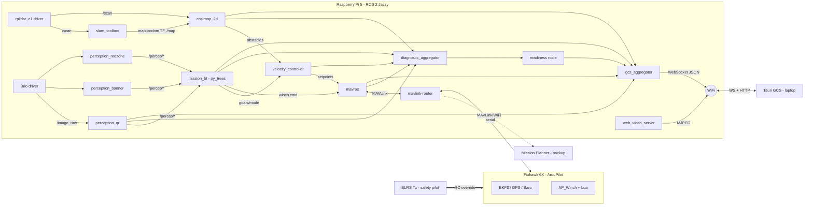
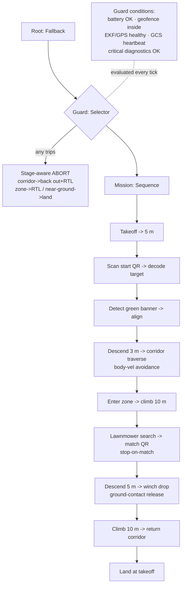
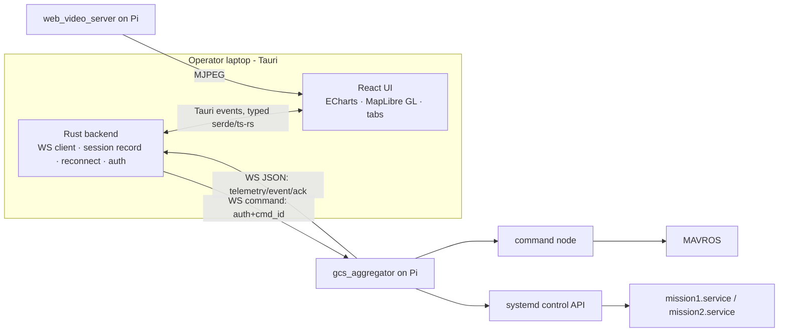

# AeroTHON 2026 — Mission 2 (SkyScan) System Architecture

**Team Rotor FPV · VIT · SAEINDIA AeroTHON 2026 Track 1**
Autonomous QR-guided delivery drone + custom control GCS.

> This document synthesizes 75 locked design decisions into one buildable reference.
> Companion: [`SETUP.md`](SETUP.md) (version-locked environment), [`../aerothon.repos`](../aerothon.repos) (workspace manifest).

---

## 1. Mission recap (what the system must do)

Fully autonomous, no manual intervention:

1. Auto takeoff → climb to **5 m**
2. Scan **start QR** → decode delivery target
3. Detect **green "AeroTHON 2026" banner** at corridor mouth → align
4. Descend to **~3 m** → traverse **3.5 m-wide corridor** with static obstacles (avoid)
5. Enter **30×40 m delivery zone** → climb to **10 m**
6. **Lawnmower search** → find the QR matching the decoded target
7. Avoid **red zones** (−5 pts each; exclusion geofence backstop)
8. Descend to **5 m** → **winch payload down**, release on ground contact
9. Climb to 10 m → **return through corridor** → land at takeoff

**Hard constraint:** MTOW **< 2 kg** (Micro UAS). Scored /100, speed-weighted.

---

## 2. Design philosophy & top risks

- **GPS/EKF is the position truth. SLAM/LiDAR only does obstacle avoidance.**
- **Flight-critical path stays defensible:** companion drives autonomy in GUIDED, but ArduPilot failsafes + a Lua companion-heartbeat check sit underneath, and the **ELRS safety pilot overrides everything**.
- **Fallback-first is strongly recommended** given the 1–3 month timeline: get a *scoring* baseline flying with ArduPilot-native proximity avoidance, then layer the full Nav2/SLAM stack on top. The ambitious stack must never be the *only* path to a flying drone.

### Risk register
| Risk | Severity | Mitigation |
|---|---|---|
| **Mass budget** (6X + Pi5 + LiDAR + winch + 4S2P vs <2 kg, T/W ~1.6–1.8) | 🔴 High | Per-gram mass-budget spreadsheet is the #1 artifact; hold MTOW ≤ ~1.8 kg |
| Timeline 1–3 months for a 6-month-class stack | 🔴 High | Fallback-first; FC-native proximity as insurance baseline |
| Baro-only altitude (no rangefinder) vs strict 5/3/10 m steps + winch ground-detect | 🟠 Med | Winch uses current-drop + encoder cap; TF-Luna is cheap insurance if revisited |
| QR read at 10 m (rolling-shutter Brio) | 🟠 Med | Damped mount, manual shutter, 4K grab, WeChatQR upgrade path, descend if needed |
| SLAM/Nav2 CPU on Pi 5 | 🟠 Med | 2D only, core pinning + rate decimation, controller RT priority |
| Red-zone penalty | 🟢 Low | Exclusion geofence (hard backstop) + visual HSV (smart layer) |

---

## 3. Hardware stack

| Subsystem | Choice |
|---|---|
| Airframe | 9″ quad, one airframe for both missions |
| Propulsion | 2312 980 KV motors + Hobbywing 35 A ESC, 9″ props |
| Battery | Li-ion **4S2P** (~120 Wh, ~400 g) |
| Flight controller | **Pixhawk 6X**, ArduPilot Copter latest stable (4.5/4.6) + Lua |
| Companion | **Raspberry Pi 5 (8 GB)** |
| GNSS | **Here3+ (F9P)** no-RTK, DroneCAN, RTK-upgradeable |
| Altitude | **Barometer only** (⚠️) |
| Obstacle sensor | **RPLidar C1** (2D 360° DTOF, 12 m, outdoor) |
| Camera | **Logitech Brio 4K** USB on a **1-axis tilt servo** |
| Payload | **DC-motor winch**, current-drop ground-detect (+ encoder cap), ArduPilot AP_Winch |
| Power | PDB, multiple regulated rails, Pi BEC ≥5 A, winch on own battery tap |
| Telemetry | MAVLink/WiFi via **mavlink-router** on Pi (primary) + **915 MHz** SiK fallback |
| RC / safety | **ELRS 2.4 GHz** (pilot override, kill, failsafe→RTL) |

---

## 4. Software stack

| Layer | Choice |
|---|---|
| OS / middleware | Ubuntu **24.04** + ROS 2 **Jazzy** |
| Dev environment | **Docker** (docker-compose: SITL/Gazebo/ROS; X11 + GPU passthrough) |
| Repo | Multiple repos + **vcstool** (+ meta-repo `.repos`, Git LFS) |
| FC bridge | **MAVROS** (exposes MAVLink as ROS 2 topics; ENU) |
| SLAM | **slam_toolbox** (2D) |
| Avoidance | Nav2 **`costmap_2d`** + **custom velocity controller** |
| Flight commands | **GUIDED** mode; hybrid setpoints (GPS position legs + body-frame velocity avoidance) |
| Perception | OpenCV **QRCodeDetector** (QR), **HSV** (banner + red), `web_video_server` (annotated stream) |
| Orchestration | **py_trees** behavior tree (top guard branch = abort-from-anywhere) |
| Language | Python for logic/glue, C++ for profiled hot paths |
| Failsafe | Companion-loss → Loiter → RTL; battery/EKF/RC layered; ELRS override |
| Geofence | ArduPilot inclusion (arena) + exclusion (red zones) polygons |
| Logging | `.bin` + `.tlog` + rosbag2 + Brio video + event log (NVMe, time-synced) |

### 4.1 Coordinate frames & setpoint strategy (hybrid)
- `map` (slam_toolbox) → `odom` (EKF via MAVROS) → `base_link` → sensor frames.
- **Waypoint legs** (takeoff, to-corridor, to-zone, home): GPS **position setpoints** in local ENU.
- **Corridor / obstacle avoidance**: **body-frame velocity setpoints** from the relative costmap geometry (drift-proof; never uses absolute SLAM pose).
- `costmap_2d` hosted in `odom`, consumed *relative to* `base_link`.
- **No GPS↔SLAM global alignment** (unnecessary; SLAM isn't the localizer).

### 4.2 CPU strategy (Pi 5, 4 cores)
Rate decimation + core pinning + RT priorities. CV @ 5–10 Hz, controller @ 20–50 Hz (protected), SLAM in between, mavlink-router+MAVROS on their own core.

---

## 5. ROS 2 node / topic graph

**Key rule:** ROS 2 DDS stays **entirely on the Pi** (`ROS_LOCALHOST_ONLY=1`). Only **WS + HTTP (TCP)** cross WiFi to the GCS.

---

## 6. Mission behavior tree (py_trees)

The **guard branch is ticked every cycle** and preempts the mission on any critical failure — this is the whole reason py_trees was chosen over a flat FSM.

---

## 7. Custom control GCS (Tauri)

**Not just a display — a full control station** (alongside Mission Planner as monitor-only backup).

### 7.1 Data schema (snapshot + event + ack)
Versioned envelope `{v, kind, t, data}`:
- **`telemetry`** — full snapshot @10 Hz (groups: mission, flight, gps, power, nav, percep, winch, safety, checklist, counters)
- **`event`** — discrete, fire-once (event log + latches checklist)
- **`ack`** — command result (accepted/rejected/done + reason)
- **`command`** (GCS→drone) — `{auth, cmd_id, cmd, args, confirm}`
- Camera on a **separate MJPEG channel**, not in the schema.
- **Type sync:** Rust structs = source of truth → **ts-rs** generates TypeScript.

### 7.2 UI (tabbed)
Overview (judge-facing default: map + camera + checklist + key telemetry) · Map · Camera · Control · Params · Logs.

### 7.3 Control & safety
- **Full command scope:** arm/disarm, takeoff, land, RTL; mission start/pause/resume/abort; mode + manual nudges; winch override + E-STOP.
- **Command safety:** token auth (LAN-only) + FC acks + confirmations + GCS-heartbeat→Loiter/RTL + ELRS pilot supremacy.
- **Readiness hard interlock:** arm/start disabled until FC pre-arm + node health + fence-loaded + sensors all green.
- **Mission selector:** picks Mission 1 (manual) or Mission 2 (autonomous) → triggers the corresponding **systemd launch profile** (M1 autonomy never starts).
- **Fence upload:** MapLibre map editor → MAVROS push → **read-back verify**.
- **Replay:** record WS stream + MJPEG → in-GCS scrub/play (live-vs-file source abstraction).
- **Authority ladder:** ELRS pilot > custom GCS (primary) > Mission Planner (backup).

### 7.4 Aux actuators
- **Mission 1:** winch + camera tilt on **pilot ELRS RC channels** (ArduPilot passthrough) — no GCS widgets.
- **Mission 2:** winch (AP_Winch/Lua) + tilt (py_trees) fully auto.

---

## 8. Simulation & testing

| Aspect | Choice |
|---|---|
| Simulator | **Gazebo Harmonic** + official `ardupilot_gz` + `ros_gz` + SITL + Mission Planner |
| Sim scope | Full Mission 2 world + simulated RPLidar & camera (QR/banner/red textures) |
| Vision test | High-res QR textures + tuned sim camera (supplement with real Brio captures) |
| Winch sim | Simplified `gz` detachable-joint (logic/timing; real current-drop = bench) |
| Sim runs | Scripted scenarios + automated pass/fail (headless CI); criteria mirror rubric |
| Realism | Randomized layouts + wind/sensor noise (domain randomization; no-RTK GPS noise) |
| Test ladder | SITL + real companion → staged real flights (manual tune first, one subsystem/flight) |
| GCS testing | vs SITL+Gazebo (full command path incl. acks/failsafe) + mock generator |

**Sim/real switch:** every node runs unchanged via `use_sim:=true` launch args + param files.

### Time sync
chrony (Pi = server, laptop = client) + MAVROS `sys_time` + GPS-UTC on FC + `/clock` in sim + a **MISSION_START anchor** written to all logs for alignment.

---

## 9. Full decision log (Q1–Q75)

See [`../MEMORY.md`](../MEMORY.md) → `aerothon-2026-mission2-stack` for the complete, updated decision list with rationale and flags. Every decision above traces to a numbered question in that log.

---

## 10. Outstanding before build

1. **Mass-budget spreadsheet** (gating artifact — every component in grams < 2000 with margin).
2. **Organizer clarifications:** physical QR size, sunlight conditions, corridor obstacle spec, geofence coordinate format, arena dimensions.
3. **Winch ground-detection** bench test (current-drop threshold + encoder cap).
4. **Fallback baseline** (ArduPilot-native proximity avoidance) built *first* as insurance.
5. **Critical vs non-critical diagnostics** classification = your written safety policy.
