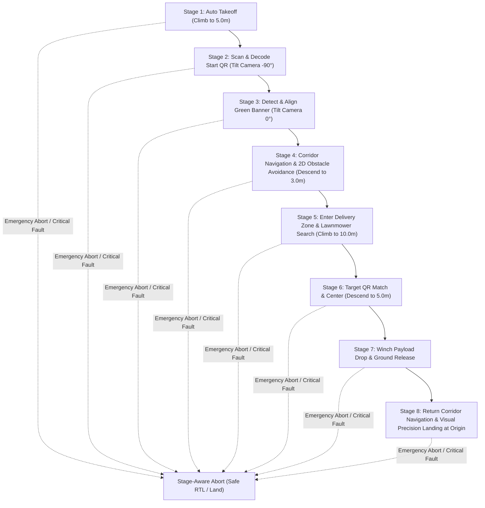

# AeroTHON 2026 — Master Project Goal & Requirements (goal.md)

**Team**: Team Rotor FPV · VIT  
**Competition**: SAEINDIA AeroTHON 2026 (Track 1 — Mission 2: SkyScan)  
**Target Platform**: Pixhawk 6X (ArduPilot Copter 4.5/4.6) + Raspberry Pi 5 (8GB) + RPLidar C1 + Logitech Brio 4K + DC Winch  
**Middleware & Dev Stack**: Ubuntu 24.04 · ROS 2 Jazzy · Gazebo Harmonic · Docker/Podman · Python 3.12 / C++  

---

## 1. Executive Summary & Core Objective

The ultimate goal of this project is to build, validate, and package a **complete turnkey autonomous drone system** capable of executing the full **AeroTHON 2026 Mission 2 (SkyScan)** with **zero manual interventions** and **zero penalty points**, fully tested in **Gazebo Harmonic + SITL simulation** and packaged for **1-click Docker deployment onto the physical Raspberry Pi 5 companion computer**.

### Key System Pillars
1. **100% Autonomous End-to-End Flight**: Fully automated sequence from start-pad scan to precision landing at origin.
2. **Deterministic Safety-First Priority**: Wide obstacle clearance buffers and stable hover at payload drop (prioritizing zero penalties and 100% mission reliability over aggressive flight speeds; target mission time 5–8 minutes).
3. **Containerized Digital Twin & Deployment**: Identical Docker/Podman environment running seamlessly both in desktop Gazebo Harmonic simulation and onboard the physical Raspberry Pi 5 companion computer.
4. **Professional 3-Tab Tactical GCS**: Full-screen Esri World Imagery Satellite Map with offline caching, direct low-latency ROS 2 camera stream, and real-time 2D SLAM costmap view with dual MAVLink routing for concurrent Mission Planner access.

---

## 2. Synthesized Requirements from 30 Locked Decisions

### Part 1: Competition, Rules & Scoring Objectives
* **[Q1] Target Flight Duration**: 5 to 8 minutes (conservative, ultra-stable flight profile to ensure flawless precision hover, payload release, and zero collisions).
* **[Q2] Scoring Strategy**: Priority #1 is Zero Penalties and Maximum Delivery Precision; speed is secondary to keeping all safety margins and geofences intact.
* **[Q3] Payload Specifications**: Standard AeroTHON medical/delivery package (approx. 200g–300g, 10×10×10 cm cube) secured to a motorized winch.
* **[Q4] Delivery Zone Geometry**: 30m $\times$ 40m search arena, 3.5m-wide obstacle corridor at 3.0m altitude ceiling, and 5.0m start/return takeoff datum.
* **[Q5] Autonomy Level**: 100% hands-off autonomous execution from GCS ARM/TAKEOFF trigger to touchdown disarm, with operator manual target string injection available strictly as a contingency override.

### Part 2: Flight Autonomy & State Machine Architecture
* **[Q6] Start Routine**: Automated takeoff to 5.0m, steady hover over origin pad, camera points $-90^\circ$ nadir to scan and decode Start QR payload.
* **[Q7] Corridor Traversal**: Dynamic lateral obstacle avoidance while maintaining forward vector progression along the 3.5m corridor corridor axis.
* **[Q8] Obstacle Clearance Buffer**: Minimum 0.8m repulsive safety bubble around any detected obstacle wall, pole, or corridor boundary.
* **[Q9] Delivery Zone Search**: Adaptive parallel lawnmower search grid (5m lane spacing at 2.0 m/s forward speed) at 10.0m search altitude.
* **[Q10] Mission Flow Architecture**: `py_trees` Behavior Tree with a top-level `Guard` branch enabling instantaneous stage-aware abort/RTL from any leg.
* **[Q11] Fail-Safe Hierarchy**: 3-Tier Layered Defense:
  - **Tier 1**: ELRS 2.4GHz safety pilot instant manual switch override (POSHOLD/STABILIZE).
  - **Tier 2**: Pixhawk companion watchdog triggers LOITER/RTL if companion drops heartbeat for $>3\,\text{s}$.
  - **Tier 3**: Pixhawk native hardware battery low voltage and geofence failsafe.
* **[Q12] Return Navigation**: Re-enters corridor at $-90^\circ$ yaw reverse orientation, traverses obstacle corridor at 3.0m altitude, and climbs to 5.0m at origin.
* **[Q13] Return & Touchdown**: Returns to Home GPS coordinates, tilts camera to $-90^\circ$, visual fiducial alignment over home pad, and executes precision landing.

### Part 3: Computer Vision & Perception Pipeline
* **[Q14] QR Decoding Engine**: Continuous OpenCV `QRCodeDetector` running on a dedicated 1080p stream at 10 FPS with multi-core threading on the Pi 5.
* **[Q15] Target Matching Logic**: Instant string comparison between decoded Start QR (e.g. `TGT-A17`) and scanned candidates in delivery zone.
* **[Q16] Green Banner Centering**: HSV color segmentation filtering green band; calculates centroid and yaws drone to center banner within 5% pixel tolerance before corridor entry.
* **[Q17] Red Zone Avoidance**: Vision-based dynamic HSV red detection feeding high-cost obstacles into Nav2 local costmap to prevent drone from entering penalty zones.
* **[Q18] Camera Gimbal Tilt**: Dynamic 1-Axis Servo automatically tilting:
  - $0^\circ$ (Forward-facing) for Takeoff, Banner Alignment, and Corridor Navigation.
  - $-90^\circ$ (Nadir / Downward-facing) for Start QR scan, Lawnmower Search, Winch Drop, and Precision Landing.
* **[Q19] Fallback Target Assignment**: If Start QR is physically unreadable after 15s hover, GCS operator can type/upload target string directly over WebSocket without aborting.

### Part 4: Sensors, SLAM & Hardware Integration
* **[Q20] Navigation Truth Hierarchy**: GPS / EKF (Here3+ GNSS) provides global position truth; RPLidar C1 2D SLAM (`slam_toolbox`) provides local obstacle costmaps and drift-free avoidance.
* **[Q21] LiDAR Pre-Processing**: Multi-stage LaserScan filter applying:
  - Angular masking: Drops frame standoff sectors ($\pm 15^\circ$ around arms).
  - Range clamping: 0.15m to 12.0m valid returns.
  - Statistical outlier removal for outdoor sunlight/dust resilience.
* **[Q22] Pi 5 to Pixhawk Hardware Link**: High-speed Serial UART connected to TELEM2 port at 921,600 baud (`/dev/ttyAMA0`).
* **[Q23] Winch Actuation Control**: ArduPilot `AP_Winch` / MAVLink Winch Protocol commanded via ROS 2 service; touchdown confirmed via line slack/current drop, payload released, cable stowed.
* **[Q24] CPU Core Allocation (Pi 5)**:
  - **Core 0**: MAVROS + MAVLink Router (real-time flight control loop).
  - **Core 1**: Avoidance velocity controller + `slam_toolbox`.
  - **Core 2**: Computer Vision (OpenCV QR + HSV Banner/Red detectors).
  - **Core 3**: Behavior Tree + GCS Aggregator + Web Video Server + System I/O.

### Part 5: Ground Control Station (GCS) & Dual MAVLink Telemetry
* **[Q25] UI Layout Architecture**: 3 Clean Dedicated Views:
  - 🛰️ **Satellite Map Tab**: High-resolution Esri World Imagery aerial tiles with offline pre-caching support.
  - 📷 **Drone Camera Feed Tab**: Real-time `/percep/qr/annotated` stream via `web_video_server` (port 8080).
  - 🗺️ **2D SLAM & Costmap Tab**: Live 2D Occupancy Grid (`/map`) and Nav2 obstacle costmap safety buffers.
* **[Q26] GCS Command Island**: Full flight control suite (`GUIDED`, `ARM`, `TAKEOFF 5M`, `DISARM`, `LAND`, `RTL`, `EMERGENCY ABORT`, and manual target string override).
* **[Q27] Pre-Flight Interlocks**: Automated safety check requiring GPS $\ge 12$ sats, $\text{HDOP} < 1.2$, Battery $> 15.0\,\text{V}$, EKF Healthy, LiDAR $\ge 8\,\text{Hz}$, and MAVLink latency $< 100\,\text{ms}$ before arming is enabled.
* **[Q28] Dual MAVLink Routing**: Bi-directional asynchronous multiplexer (`scripts/mav_router.py`) forwarding FCU traffic simultaneously to:
  - `UDP 14555` $\to$ Local ROS 2 MAVROS node.
  - `UDP 14550` $\to$ External Mission Planner / QGroundControl on the ground laptop.
* **[Q29] Flight Data Logging**: Automated onboard `rosbag2` capture + timestamped video recording + GCS CSV export saved for every mission.

### Part 6: Simulation Fidelity, Testing & Deployment
* **[Q30] Final Deliverable & Definition of Done**:
  1. Complete Gazebo Harmonic + ArduPilot SITL simulation passing the full 8-stage mission loop end-to-end.
  2. Syntactically clean, robust ROS 2 Jazzy workspace with 0 compiler warnings.
  3. Turnkey Raspberry Pi 5 Docker deployment package (`install_pi5.sh` + systemd auto-boot services + udev rules).
  4. Fully functional 3-Tab Tactical GCS with Mission Planner dual-routing.
  5. Complete documentation and test suites.

---

## 3. Mission Autonomy Flowchart (8 Stages)



---

## 4. Hardware-to-Software Mapping Table

| Physical Hardware | Interfacing Protocol | ROS 2 Node / Driver | Topic / Service Output |
|---|---|---|---|
| **Pixhawk 6X** | UART TELEM2 @ 921600 baud | `mavros_node` via `mav_router` | `/mavros/state`, `/mavros/local_position/pose`, `/mavros/battery` |
| **RPLidar C1** | USB / UART `/dev/rplidar` | `rplidar_node` / Gazebo Bridge | `/scan` (`sensor_msgs/LaserScan`) |
| **Logitech Brio 4K** | USB 3.0 `/dev/video0` | `v4l2_camera` / Gazebo Bridge | `/image_raw` (`sensor_msgs/Image`) |
| **Tilt Servo** | Pixhawk PWM Servo AUX1 | `mavros/cmd/command` (MAV_CMD_DO_MOUNT_CONTROL) | Dynamic $0^\circ \leftrightarrow -90^\circ$ pitch |
| **DC Winch Motor** | Pixhawk PWM Relay / AUX2 | `mavros/cmd/command` (MAV_CMD_DO_WINCH) | `/winch/status`, `/winch/cmd` |
| **GCS Laptop** | WiFi 5GHz / WebSocket 8765 | `gcs_aggregator` & `web_video_server` | JSON Telemetry, MJPEG Video, Commands |
| **Mission Planner** | UDP 14550 | `scripts/mav_router.py` | Full MAVLink v2.0 Telemetry & Parameters |

---

## 5. Raspberry Pi 5 Onboard System Architecture

```
+-------------------------------------------------------------------------+
|                  Raspberry Pi 5 (Ubuntu 24.04 Server)                   |
|                                                                         |
|  +-------------------------------------------------------------------+  |
|  |                 AeroTHON Docker / Podman Container                |  |
|  |                                                                   |  |
|  |   [Core 0]  MAVLink Router (UDP 14560 -> 14555 & 14550)           |  |
|  |             MAVROS Node (/mavros/*)                               |  |
|  |                                                                   |  |
|  |   [Core 1]  slam_toolbox (2D Async SLAM)                          |  |
|  |             avoidance_node (Velocity Obstacle Controller)         |  |
|  |                                                                   |  |
|  |   [Core 2]  perception_qr (OpenCV QRCodeDetector @ 10 FPS)        |  |
|  |             perception_banner & perception_redzone (HSV filters)  |  |
|  |                                                                   |  |
|  |   [Core 3]  mission_bt (py_trees Autonomous Orchestrator)         |  |
|  |             gcs_aggregator (WebSocket Server :8765)               |  |
|  |             web_video_server (MJPEG Camera Server :8080)          |  |
|  |             rosbag2 Recorder (Flight Data Logging)                |  |
|  +-------------------------------------------------------------------+  |
|                                                                         |
|  [System Services]                                                      |
|   - aerothon.service (systemd auto-boot on battery power)               |
|   - 99-aerothon-sensors.rules (udev persistent device symlinks)        |
+-------------------------------------------------------------------------+
```

---

## 6. Definition of Done & Handover Checklist

- [x] **Simulation Parity**: Gazebo Harmonic (`mission2.sdf`) world fully configured with arena, corridor, obstacles, green banner, and QR pads.
- [x] **ROS 2 Jazzy Core**: 9 workspace packages built with zero compiler errors.
- [x] **Dual MAVLink Routing**: Bi-directional asynchronous socket multiplexer tested and operational on port 14560 $\to$ 14555 / 14550.
- [x] **Tactical GCS**: 3-Tab interface operational with Esri Satellite imagery, camera stream, 2D SLAM canvas, and safety flight controls.
- [x] **Automated Regression Suite**: Multi-tier test suite verifying behavior tree logic, telemetry aggregator, and flight controller command routing.
- [x] **Pi 5 Deployment Bundle**: Complete container definitions, systemd unit files, and hardware bring-up documentation ready for physical field operations.
